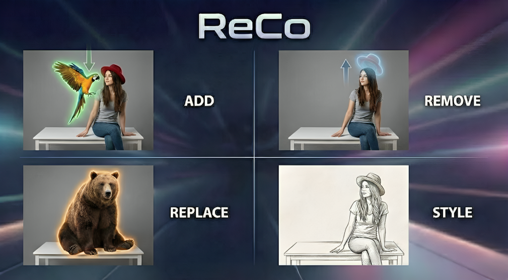
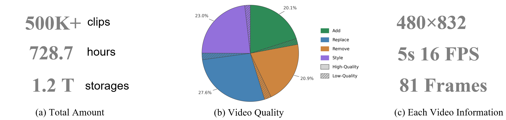

# ReCo

<p align="center">
    
<p>

<p align="center">
    🖥️ <a href="https://github.com/HiDream-ai/ReCo">GitHub</a> &nbsp&nbsp ｜ &nbsp&nbsp  🌐 <a href="https://zhw-zhang.github.io/ReCo-page/"><b>Project Page</b></a> &nbsp&nbsp  | &nbsp&nbsp🤗 <a href="https://huggingface.co/datasets/HiDream-ai/ReCo-Data">ReCo-Data</a>&nbsp&nbsp | &nbsp&nbsp 📈 <a href="https://huggingface.co/datasets/HiDream-ai/ReCo-Bench">ReCo-Bench</a>&nbsp&nbsp | &nbsp&nbsp 🤗 <a href="https://huggingface.co/HiDream-ai/ReCo">ReCo-Models(TBD)  </a> &nbsp&nbsp | &nbsp&nbsp 📖 <a href="https://arxiv.org/pdf/2505.20287">Paper</a> &nbsp&nbsp 
<br>


[**ReCo: Region-Constraint In-Context Generation for Instructional Video Editing**](https://zhw-zhang.github.io/ReCo-page/) <be>

🔆 If you find ReCo useful, please give a ⭐ for this repo, which is important to Open-Source projects. Thanks!


Here, we will gradually release the following resources, including:

* **ReCo training dataset:** ReCo-Data
* **Evaluation code:** ReCo-Bench
* **Model weights, inference code, and training code**


## Video Demos

<div align="center">
  <video controls autoplay loop muted playsinline src="https://github.com/user-attachments/assets/ba530e6f-e13b-4d04-ad60-b95277cc38ce"></video>
  <p><em>Examples of different video editing tasks by our ReCo.</em></p>
</div>


## 🔥 Updates
- ✅ **\[2025.12.20\]** Upload Our arXiv Paper.
- ✅ **\[2025.12.20\]** Release ReCo-Data and Usage code.
- ✅ **\[2025.12.21\]** Release ReCo-Bench and evaluation code.
- ⬜ Release Model weights and inference code in 2-3 weeks.
- ⬜ Release training code.


## 📊 ReCo-Data Preparation

**ReCo-Data** is a large-scale, high-quality video editing dataset consisting of **500K+ instruction–video pairs**, covering four video editing tasks: **object addition (add)**, **object removal (remove)**, **object replacement (replace)**, and **video stylization (style)**.

<p align="center">
    
<p>

### Downloading ReCo-Data

Please download each task of ReCo-Data into the `./ReCo-Data` directory by running:

```bash
bash ./tools/download_dataset.sh
````

Before downloading the full dataset, you may first browse the
**[visualization examples](https://huggingface.co/datasets/HiDream-ai/ReCo-Data/blob/main/examples.tar)**.

These examples are generated by **randomly sampling 50 instances from each task**
(add, remove, replace, and style), **without any manual curation or cherry-picking**,
and are intended to help users quickly inspect and assess the overall data quality.

Note: The examples are formatted for visualization convenience and do not strictly follow the dataset format.

### Directory Structure

After downloading, please ensure that the dataset follows the directory structure below:

<details open>
<summary>ReCo-Data directory structure</summary>

```text
ReCo-Data/
├── add/
│   ├── add_data_configs.json
│   ├── src_videos/
│   │   ├── video1.mp4
│   │   ├── video2.mp4
│   │   └── ...
│   └── tar_videos/
│       ├── video1.mp4
│       ├── video2.mp4
│       └── ...
├── remove/
│   ├── remove_data_configs.json
│   ├── src_videos/
│   └── tar_videos/
├── replace/
│   ├── replace_data_configs.json
│   ├── src_videos/
│   └── tar_videos/
└── style/
    ├── style_data_configs.json
    ├── src_videos/
    │   ├── video1.mp4
    │   └── ...
    └── tar_videos/
        ├── video1-a_Van_Gogh_style.mp4
        └── ...
```

</details>

### Testing and Visualization

After downloading the dataset, you can directly test and visualize samples from **any single task** using the following script
(taking the **replace** task as an example):

```bash
python reco_data_test_single.py \
  --json_path ./ReCo-Data/replace/replace_data_configs.json \
  --video_folder ./ReCo-Data \
  --debug
```

### Mixed Task Loading

You can also load a **mixed dataset** composed of the four tasks (**add**, **remove**, **replace**, and **style**) with arbitrary ratios by running:

```bash
python reco_data_test_mix_data.py \
  --json_folder ./ReCo-Data \
  --video_folder ./ReCo-Data \
  --debug
```

### Notes

* `src_videos/` contains the original source videos.
* `tar_videos/` contains the edited target videos corresponding to each instruction.
* `*_data_configs.json` stores the instruction–video mappings and metadata for each task.


## 📈 Evaluation

### VLLM-based Evaluation Benchmark
<details close>
<summary>ReCo-Bench details</summary>

Traditional video generation metrics often struggle to accurately assess the fidelity and quality of video editing results. Inspired by recent image editing evaluation protocols, we propose a **VLLM-based evaluation benchmark** to comprehensively and effectively evaluate video editing quality.


We collect **480 video–instruction pairs** as the evaluation set, evenly distributed across four tasks: **object addition**, **object removal**, **object replacement**, and **video stylization** (120 pairs per task). All source videos are collected from the **Pexels** video platform.


For local editing tasks (add, remove, and replace), we utilize **Gemini-2.5-Flash-Thinking** to automatically generate diverse editing instructions conditioned on video content. For video stylization, we randomly select **10 source videos** and apply **12 distinct styles** to each, resulting in **120 stylization evaluation pairs**.
</details>

---

### Downloading ReCo-Bench
Please download **ReCo-Bench** into the `./ReCo-Bench` directory by running:
```bash
bash ./tools/download_ReCo-Bench.sh
````


---


### Usage


After downloading the benchmark, you can directly start the evaluation using:
```bash
bash run_eval_via_gemini.sh
```


<details close>
<summary>This script performs the evaluation in two stages:</summary>

#### Step 1: Per-dimension Evaluation with Gemini
In the first stage, **Gemini-2.5-Flash-Thinking** is used as a VLLM evaluator to score each edited video across multiple evaluation dimensions.

Key arguments used in this step include:
* `--edited_video_folder`: Path to the folder containing the edited (target) videos generated by the model.

* `--src_video_folder`: Path to the folder containing the original source videos.

* `--base_txt_folder`: Path to the folder containing task-specific instruction configuration files.

* `--task_name`: Name of the evaluation task, one of `{add, remove, replace, style}`.


This step outputs per-video, per-dimension evaluation results in JSON format.

#### Step 2: Final Score Aggregation

After all four tasks have been fully evaluated, the second stage aggregates the evaluation results and computes the final scores.
* `--json_folder`: Path to the JSON output folder generated in Step 1

  (default: `all_results/gemini_results`)

* `--base_txt_folder`: Path to the instruction configuration folder

This step produces the final benchmark scores for each task as well as the overall performance. 


</details>


## 🏃🏼 Inference
Stay tuned — we will open-source the model weights and inference codes within 2–3 weeks expectly.

## 🚀 Training
Will be released soon.


## 🌟 Star and Citation
If you find our work helpful for your research, please consider giving a star⭐ on this repository and citing our work.
```
@artical{
}
```


## 💖 Acknowledgement
<span id="acknowledgement"></span>

Our code is inspired by several works, including [WAN](https://github.com/Wan-Video/Wan2.1), [ObjectClear](https://github.com/zjx0101/ObjectClear)--a strong object remover, [VACE](https://github.com/ali-vilab/VACE), [Flux-Kontext-dev](https://github.com/black-forest-labs/flux). Thanks to all the contributors! 


